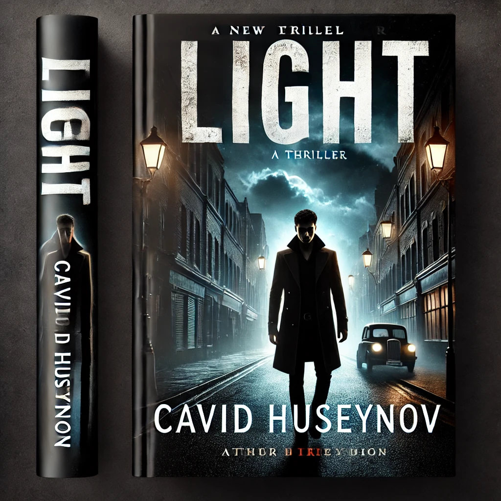

Глава 1: Дэвид Хантер

Отец Дэвида, Томас Хантер, был прокурором. Спустя всего несколько дней после вынесения приговора главе итальянской мафии Эмануэлю Гонсалесу на 25 лет тюрьмы, он был убит перед зданием суда после работы. Жена Томаса умерла много лет назад, оставив ему только сына.

Дэвиду было всего 20 лет, когда он получил эту новость. Потеря отца после смерти матери усилила боль внутри него. Его внутренний мир был мрачен и пуст. Мысли были хаотичными, как нескончаемая буря. Компас его жизни не показывал направления, вращаясь, словно вихрь. Мысли росли, словно лавина в его голове, тяжело давя на тело.

Но ничего из этого внутреннего хаоса не проявлялось снаружи. Его лицо было спокойным, как тихое море, а взгляд — холодным. Каждую ночь он шел в парк, сидел в тишине и смотрел в темноту.

Однажды ночью, сидя в парке, он почувствовал, как кто-то прошел позади него. Повернувшись, он увидел, как тень быстро исчезла. Оглянувшись, он заметил рядом черный конверт. Он открыл конверт и нашел адрес с подписью "Т.К.". С первыми лучами рассвета Дэвид встал и ушел. Адрес привел его к двери заброшенного завода. Дверь была закрыта, и никого не было вокруг. В ту ночь, вместо того чтобы пойти в парк, он вернулся по тому адресу.

Когда он был в нескольких метрах от двери, человек, одетый в черное, напоминающий ниндзя, с закрытым лицом, открыл дверь. Дэвид тихо вошел. Мужчина пошел вперед, и Дэвид последовал за ним. Человек в черном наклонился и открыл люк. Под люком оказался туннель. Они спустились по лестнице и прошли через туннель, оказавшись в подземном месте, напоминающем военную базу, с несколькими комнатами.

Человек в черном жестом указал и сказал:

"Войдите и подождите."

Дэвид вошел. Комната напоминала те, что показывают в фильмах — стол и стул с каждой стороны. Двадцать-тридцать минут спустя человек в черном вернулся, держа какие-то бумаги. Он положил их на стол и сказал:

"Прочитай эту информацию. После прочтения ты можешь уйти в любое время. Если останешься, с тобой поговорит Такеши Кага."

Дэвид приблизил бумаги и начал читать. Первое дело содержало информацию о его матери, отце и самом Дэвиде. Подробное описание работы его отца, кто его убил и как все произошло, было написано в деталях.

Второе дело касалось убийцы: Дерек Лоусон, 38 лет, наркозависимый бродяга и убийца. Дэвид нахмурился и смотрел на фотографию убийцы несколько минут, запоминая его черты на случай, если они когда-нибудь встретятся.

Наконец, он взял последнее дело. На обложке было написано "Темный Туман". Внутри было лишь краткое описание гильдии убийц, расположенной в горах Японии.

"Опасная организация, выполняющая убийства за деньги. У них есть группы, готовые действовать в любой стране в любое время. Чтобы скрыть свои личности, убийцы часто ведут обычную жизнь, работая на обычных работах. У них есть семьи и друзья, что делает их чрезвычайно трудными для отслеживания. Самый известный из разоблаченных убийц — Эмануэль Гонсалес, который, в отличие от других, не скрывается."

Дэвид вернул бумаги на стол, встал и начал ходить по комнате в глубокой задумчивости. Пока он бродил, дверь открылась. Вошел японец средних лет с острым взглядом. Спокойным голосом он сказал:

"Привет, Дэвид. Меня зовут Такеши Кага. Надеюсь, ты не заскучал. Пожалуйста, садись. Давай немного поговорим."

Они оба сели, и Такеши продолжил:

"Мне жаль, что ты потерял семью в таком молодом возрасте. Я могу представить, как это трудно для тебя. Я тоже потерял свою семью, когда был молод. Сейчас я даже не могу их вспомнить. Но давай перейдем к делу. Что ты хочешь, Дэвид? Почему ты здесь?"

Дэвид ответил:

"Это вы меня вызвали. Разве не мне нужно задать этот вопрос?"

Такеши слегка улыбнулся.

"Ах... Нет, нет, Дэвид... Подумай внимательно. Кто-то, кого ты никогда не видел, оставляет тебе письмо, и ты решаешь пойти по указанному в нем адресу. Ты хотел прийти, Дэвид. Так скажи мне, чего ты хочешь?"

"Я не знаю..." — сказал Дэвид неуверенно.

Такеши сказал: "Те, кто творит зло, распространяют отчаяние своими действиями. Те, кто теряет надежду, умирают духом. Ты хочешь вернуть свою надежду и вдохнуть жизнь в свою душу."

Такеши встал и сказал:

"Иди за мной."

Они оба вышли и направились к двери в конце коридора.

Такеши открыл дверь, и они вошли. Внутри на земле лежал мужчина в потрепанной одежде. Человек в черном, который встретил Дэвида при его прибытии, вошел и поднял мужчину. Дэвид узнал его лицо — это был Дерек Лоусон, убийца его отца.

Такеши достал нож с пояса, протянул его Дэвиду и сказал:

"Возьми этот нож и отомсти за своего отца. Пусть твоя душа возродится."

Дэвид взял нож и подошел ближе к мужчине.

Дэвид приблизился к мужчине, опустился на колени и посмотрел ему в глаза. Он снова встал, вернул нож Такеши и сказал:

"Этот жалкий пешка не имеет значения. Его смерть не вернет жизнь в мою душу."

Такеши взял нож у Дэвида и передал его человеку в маске. Не колеблясь, человек в маске взял нож и вонзил его в сердце убийцы. Дерек Лоусон хрипнул, его глаза на мгновение широко раскрылись, прежде чем его тело безжизненно рухнуло на пол.

Дэвид смотрел молча; его выражение было холодным и неизменным. Не было ни удовлетворения, ни чувства завершенности — только углубившаяся пустота, которая оставалась внутри. Действие, которое, как он думал, принесет мгновение облегчения, вместо этого лишь подтвердило пустоту внутри него.

Такеши посмотрел на Дэвида, изучая его реакцию.

"Похоже, ты понимаешь больше, чем я ожидал," — сказал он спокойно. "Убийство не восстанавливает душу, Дэвид. Но знание того, кто дергает за ниточки, восстанавливает. Человек, который приказал убить твоего отца, все еще на свободе, и его влияние простирается намного дальше, чем ты видел."

Дэвид повернулся к Такеши, его глаза были полны решимости.

"Тогда скажи мне, кто он," — потребовал он, его голос был твердым. "Я хочу найти его. Я хочу правду."

Такеши медленно кивнул, признавая решимость во взгляде Дэвида.

"Ты найдешь свои ответы, но это займет время. А пока тебе нужно подготовиться. Путь, по которому ты собираешься идти, темнее и опаснее, чем ты можешь себе представить."
